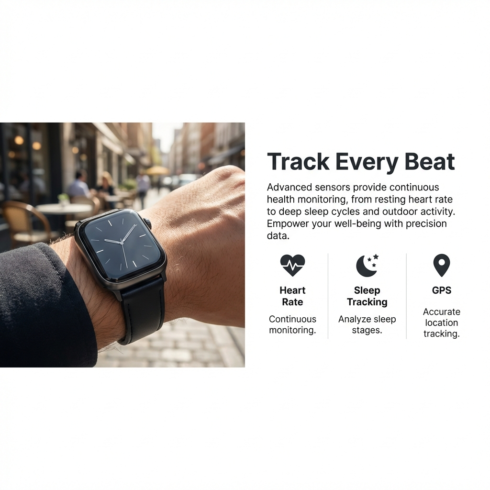

# A+ Content Section

Add rich, Amazon-style product details to your product pages with this "A+ Content" section. It features a modern, split-layout design, feature icons, and full-width banners, all with smooth entry animations.

## Features
- **Split Layouts**: Image on left or right with accompanying text.
- **Feature Icons**: 3-column grid for highlighting key specs.
- **Full Width Banner**: Large impact imagery with overlay text.
- **Animations**: Elements fade in as you scroll.
- **Fully Customizable**: Change colors, spacing, and content via the customized settings.

## Installation

1. **Copy the Code**: Open `section-aplus-content.liquid` and copy all the code.
2. **Create Section**:
   - Go to your Shopify Admin > Online Store > Themes.
   - Click "Actions" > "Edit code".
   - Under "Sections", click "Add a new section".
   - Name it `aplus-content`.
   - Paste the copied code and save.

## Usage

1. **Add to Template**:
   - Go to the Theme Editor (Customize).
   - Navigate to the Product page template (or any page where you want this).
   - Click "Add section" and search for "A+ Content".
2. **Configure**:
   - Add blocks like "Image & Text", "Features Grid", or "Full Width Banner".
   - Adjust settings for each block.
   - Use the section settings to change background color and spacing.