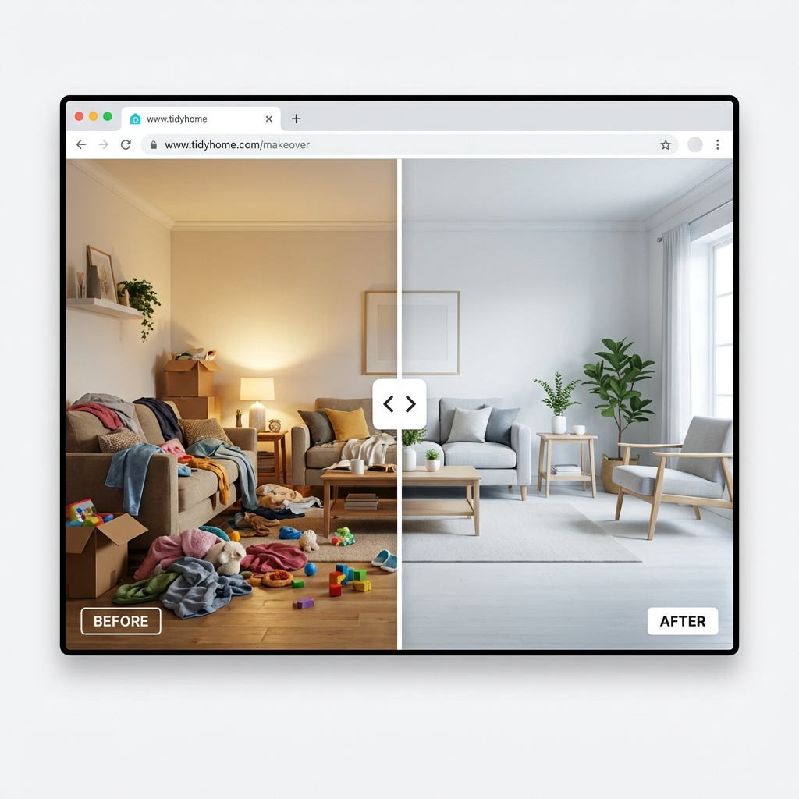

# Before/After Image Slider

Engage your customers with this interactive image comparison slider. Perfect for showcasing product results, presets, cleaning services, or any "Before & After" transformation.

## Features
- **Interactive Drag Handle**: Smooth touch and mouse control to reveal the differences.
- **Customizable**: Adjust height, initial position, and handle color.
- **Responsive**: Adapts to screen sizes (stacking or resizing logic handled in CSS).
- **Lightweight**: Pure CSS and Vanilla JS, no heavy libraries.

## Installation

1. **Copy the Code**: Open `section-before-after.liquid` and copy all contents.
2. **Create Section**:
   - In Shopify Admin > Online Store > Themes > Edit code.
   - Add a new section named `before-after-slider`.
   - Paste the code.

## Usage

1. **Add to Page**:
   - Go to Theme Customizer.
   - Add "Before/After Slider" section.
2. **Select Images**:
   - **Before Image**: The bottom layer (e.g., the original state).
   - **After Image**: The top layer (e.g., the result).
   - For best results, use two images of the exact same dimensions.
3. **Customize**:
   - Change the handle color to match your brand.
   - Adjust section height to fit your layout.
