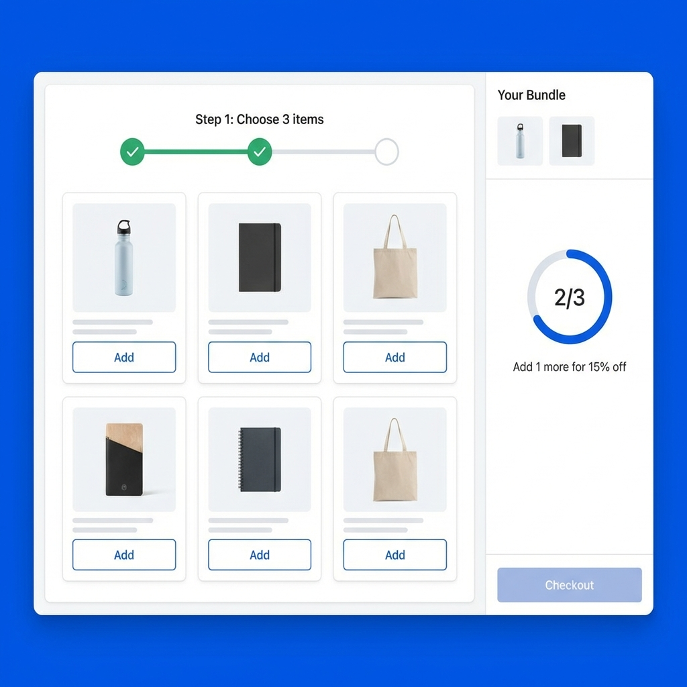

# Pro Bundle Builder

A highly engineered, client-side bundle builder that rivals paid apps. Features a multi-step "Wizard" interface, real-time discount calculations, and a Python-powered configuration workflow.

## Features
- **Zero Server Costs**: Runs entirely in the browser using Shopify AJAX API.
- **Python Config Tool**: `tools/bundle_config_generator.py` helps you generate complex logic without writing raw JSON.
- **Dynamic State**: Tracks selections, steps, and pricing in real-time.
- **Discount Support**: "Buy X get Y% off" logic built-in.

## Installation

1. **Add Section**:
   - Create a new Liquid section named `bundle-builder`.
   - Copy contents of `pro_bundle_builder/section-bundle-builder.liquid`.
2. **Setup Logic**:
   - You need to configure your products.
   - Open `tools/bundle_config_generator.py` in your code editor.
   - Edit the `BUNDLE_CONFIG` dictionary with your Product IDs and steps.
   - Run `python3 tools/bundle_config_generator.py`.
   - Copy the output string.
3. **Configure**:
   - Go to Theme Editor > Add Section > "Pro Bundle Builder".
   - Paste the generated JSON string into the "Bundle Config JSON" setting.

## Why Python?
Shopify Section Settings have limits and writing complex nested JSON by hand is error-prone. The Python script acts as a "Compiler" to validate your logic and minify the output for optimal performance.
