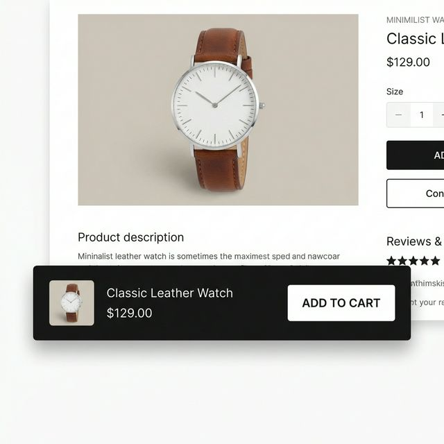

# Sticky Buy Bar

A conversion-optimized sticky bar that appears as visitors scroll down a product page, keeping the Add-to-Cart button always accessible. This pattern is commonly seen on high-performing e-commerce stores.

## Features

- **Scroll-Triggered Visibility**: Bar smoothly slides in after scrolling past a configurable threshold.
- **Product Info Display**: Shows product image, title, and price (with sale price support).
- **Variant Selector**: Dropdown to select variants if product has multiple options.
- **AJAX Add-to-Cart**: Adds products without page reload, with loading and success states.
- **Customizable Appearance**: Background, text, and button colors via Theme Customizer.
- **Position Options**: Display at top or bottom of viewport.
- **Fully Responsive**: Adapts gracefully on mobile devices.

## Installation

1. **Copy the Code**: Open `section-sticky-buy-bar.liquid` and copy all contents.
2. **Create Section**:
   - In Shopify Admin → Online Store → Themes → Edit code.
   - Under "Sections", click "Add a new section".
   - Name it `sticky-buy-bar` and paste the code.
3. **Add to Product Template**:
   - Go to Theme Customizer on a product page.
   - Add the "Sticky Buy Bar" section.

## Customization Options

| Setting | Description | Default |
|---------|-------------|---------|
| Background Color | Bar background | `#1a1a1a` |
| Text Color | Title and price text | `#ffffff` |
| Button Background | ATC button color | `#ffffff` |
| Button Text Color | ATC button text | `#1a1a1a` |
| Show Price | Toggle price visibility | On |
| Show Product Image | Toggle image thumbnail | On |
| Bar Position | Top or bottom of screen | Bottom |
| Show After Scroll | Scroll distance to trigger | 400px |

## Credits

Part of the [Awesome Shopify Sections](https://github.com/your-repo/awesome-shopify-sections) collection.
